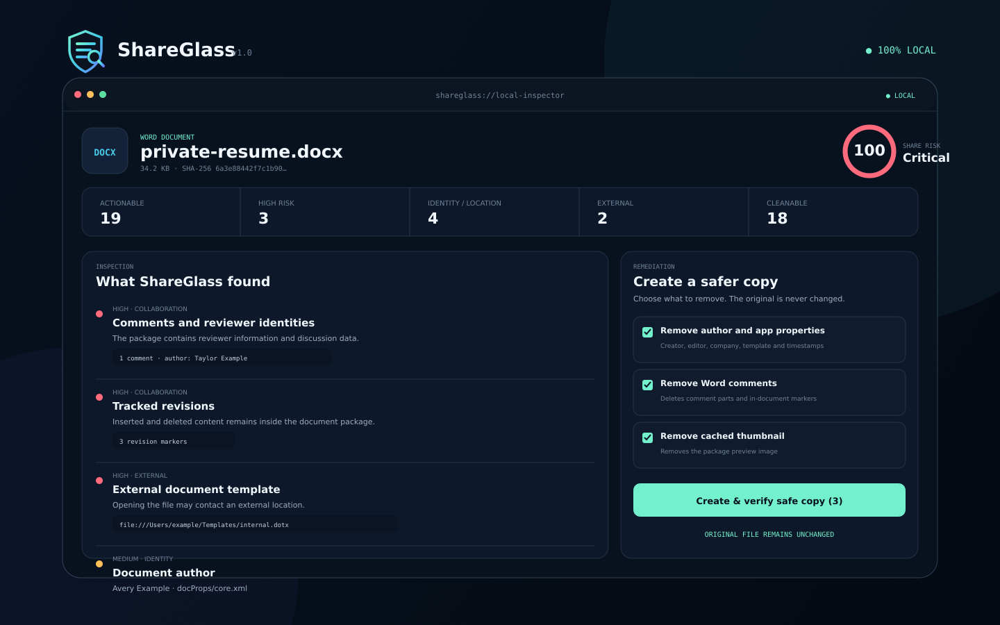

<p align="center">
  
</p>

<h1 align="center">ShareGlass</h1>

<p align="center"><strong>See what your files reveal before you share them.</strong></p>

<p align="center">
  Local-first privacy and provenance inspection for Office documents, PDFs, and images.<br>
  No upload. No account. No telemetry.
</p>

<p align="center">
  <a href="https://jinyounghub.github.io/shareglass/"><strong>Live demo</strong></a> ·
  <a href="https://github.com/jinyounghub/shareglass/stargazers"><strong>★ Star</strong></a> ·
  <a href="docs/README.ko.md">한국어</a> ·
  <a href="#command-line">CLI</a> ·
  <a href="ROADMAP.md">Roadmap</a> ·
  <a href="SECURITY.md">Security</a>
</p>

<p align="center">
  <a href="https://github.com/jinyounghub/shareglass/actions/workflows/ci.yml"></a>
  <a href="https://www.npmjs.com/package/@jin0/shareglass"></a>
  <a href="https://github.com/jinyounghub/shareglass/releases/latest"></a>
  
  
  
</p>



A résumé, contract, spreadsheet, slide deck, or photo can disclose much more than its visible content. ShareGlass opens the file structure locally and explains identities, precise location, collaboration history, external connections, active content, and provenance signals before the file leaves your device.

## Try a risky file in one click

No file handy? Open a synthetic sample directly—nothing is uploaded.

| Demo | Deliberately contains | Open |
|---|---|---|
| Private résumé | author/company identity, reviewer comments, tracked revisions, an external template | [Inspect the résumé →](https://jinyounghub.github.io/shareglass/?sample=private-resume.docx) |
| Geotagged image | precise GPS coordinates, device/software identity, image metadata | [Inspect the photo →](https://jinyounghub.github.io/shareglass/?sample=private-photo.png) |
| Active PDF | JavaScript/actions, an attachment, document metadata, external URLs | [Inspect the PDF →](https://jinyounghub.github.io/shareglass/?sample=risky-contract.pdf) |

Open a finding to see the evidence and exact package path. For supported formats, select the safe-copy actions and click **Create & verify safe copy**. The included files contain only fictional data.

> Found something you did not expect? [Star ShareGlass](https://github.com/jinyounghub/shareglass) so more people remember to inspect a file before sending it.

## What it finds

| Format | Inspects | Safe-copy support |
|---|---|---|
| JPEG | EXIF, GPS, XMP, IPTC, comments, C2PA/JUMBF markers | Removes metadata segments while preserving encoded image data |
| PNG | text chunks, EXIF, timestamps, XMP, C2PA markers | Removes metadata chunks while preserving image data chunks |
| WebP | EXIF, XMP, metadata feature flags, C2PA markers | Removes EXIF/XMP chunks and updates container flags |
| DOCX | authors, company, comments, reviewers, tracked revisions, hidden text, custom XML, external links/templates, thumbnails, embedded objects, macros, signatures | Selective package cleanup followed by a complete re-scan |
| XLSX | properties, external links, hidden sheets, comments, custom XML, embedded objects, macros, signatures | Properties, thumbnails, custom data, and external target neutralization |
| PPTX | properties, external links, notes/comments, hidden slides, embedded objects, macros, signatures | Properties, thumbnails, custom data, and external target neutralization |
| PDF | document info, XMP, URLs, JavaScript/actions, attachments/rich media, forms, encryption, signatures, incremental updates, C2PA markers | Inspection only in v1 |

ShareGlass reports structural indicators. It does not claim to prove that a file is harmless, anonymous, or malware-free. See the [threat model](docs/THREAT_MODEL.md).

## More than a metadata stripper

| A basic metadata remover | ShareGlass |
|---|---|
| Deletes a fixed set of fields | Explains identity, location, collaboration, external-link, active-content, and provenance findings |
| Usually targets photos only | Inspects images, Office packages, and PDFs in one local workflow |
| Assumes cleaning succeeded | Re-scans every supported safe copy and compares a content fingerprint |
| May overwrite or silently rewrite | Always creates a separate file and requires confirmation for destructive or signature-breaking actions |
| Gives little evidence | Shows the exact container path and bounded evidence for every finding |

## Why local-first

Files selected in the web app are read by browser APIs and analyzed in the current tab. The app has:

- no upload endpoint;
- no analytics or tracking script;
- no account system;
- no server-side file processing;
- no API key requirement.

The optional **Content Credentials** button loads the official `@contentauth/c2pa-web` SDK and its WebAssembly module from jsDelivr only after the user requests cryptographic validation. The selected file is still passed directly from memory to the SDK and is not uploaded by ShareGlass. Self-hosting can vendor those assets to avoid any third-party network request.

## Safe copies are verified, not assumed

ShareGlass never overwrites the source file. A safe-copy operation follows four steps:

1. Apply only the actions the user selected.
2. Generate a new file with `.safe` in the name.
3. Run every applicable detector again on the generated bytes.
4. Compare a content fingerprint that excludes the metadata being removed.

Potentially destructive operations—accepting tracked changes, removing custom XML, neutralizing external relationships, or modifying a signed/provenance-bearing file—require an explicit choice or confirmation.

PDF rewriting is intentionally unavailable in v1. Safe PDF rewriting requires preserving cross-reference structures, object streams, forms, rendered output, encryption, and signature semantics. ShareGlass reports those risks rather than presenting unsafe search-and-replace as sanitization.

## Web app

No build step is required for development:

```bash
git clone https://github.com/jinyounghub/shareglass.git
cd shareglass
python3 -m http.server 4173
```

Open `http://localhost:4173`. A local HTTP server is required because browsers restrict module imports, service workers, and WebAssembly on `file://` URLs.

To create the production directory used by GitHub Pages:

```bash
npm run build
```

The result is written to `dist/` and remains a static application.

## Command line

The CLI uses the same zero-runtime-dependency inspection core as the web app.

```bash
npm install --global @jin0/shareglass

# Or run directly without a global install
npx @jin0/shareglass scan resume.docx
```

```bash
# From a checkout
node bin/shareglass.mjs scan samples/private-resume.docx

# After installing or linking the package
shareglass scan resume.docx
shareglass scan release-assets/* --fail-on high
shareglass scan contract.pdf --json > report.json
shareglass scan photo.jpg --markdown > report.md
```

Create a safer image or Office copy:

```bash
shareglass clean photo.jpg
shareglass clean resume.docx
shareglass clean resume.docx --custom-data --neutralize-links
shareglass clean reviewed.docx --accept-changes
```

Privacy-safe Office defaults remove document properties, Word comments, and cached thumbnails. Optional flags add transformations; they do not disable the defaults.

Use `--force-signed` only when an unsigned Office copy is intentional. Use `--force-provenance` only when an unsigned image derivative is intentional.

### CI policy example

```yaml
- name: Inspect release files
  run: node bin/shareglass.mjs scan "release/manual.pdf" "release/screenshots.png" --fail-on high
```

Exit status is `2` when a report reaches the selected `--fail-on` level, and `1` for operational errors.

## Detection philosophy

ShareGlass favors explainable evidence over opaque scoring:

- every finding names a severity, category, source path, and evidence;
- Office files are inspected as OPC/ZIP packages, not only through visible text;
- image metadata is parsed from container segments and TIFF IFDs;
- PDF findings identify structural tokens and object references;
- risk scores summarize findings but never replace the underlying evidence;
- cleaning is format-aware and followed by re-inspection.

The detector catalog and known limitations are documented in [docs/DETECTORS.md](docs/DETECTORS.md).

## Development

Requirements: Node.js 22 or newer. The repository deliberately has no runtime or development dependencies.

```bash
npm run samples   # regenerate synthetic fixtures
npm run check     # syntax and repository integrity checks
npm test          # core, sanitizer, fixture, and CLI tests
npm run build     # create the static dist directory
npm run ci        # run everything used by GitHub Actions
```

Architecture:

```text
src/core/
├── analyze.js              public orchestration API
├── detectors/              JPEG/PNG/WebP, OOXML, PDF
├── sanitizers/             image and OOXML safe-copy writers
├── zip.js                  bounded OPC/ZIP reader and deterministic writer
├── c2pa.js                 optional official browser SDK integration
├── findings.js             normalized findings and risk scoring
└── report.js               JSON and Markdown output
```

Read [docs/ARCHITECTURE.md](docs/ARCHITECTURE.md) before adding a format or sanitizer. Small detector contributions are welcome; see [CONTRIBUTING.md](CONTRIBUTING.md), the [roadmap](ROADMAP.md), and the open issues.

## Privacy and security

- [Privacy statement](PRIVACY.md)
- [Security policy](SECURITY.md)
- [Threat model](docs/THREAT_MODEL.md)
- [Safe-copy guarantees and limits](docs/SAFE_COPY.md)

For a suspected vulnerability, use GitHub's private vulnerability reporting instead of opening a public issue.

## Project status

`v1.0.0` is a usable first release with browser and CLI inspection, image/OOXML safe-copy generation, synthetic fixtures, automated tests, a PWA shell, and a GitHub Pages deployment workflow. See [ROADMAP.md](ROADMAP.md) and the open issues for scoped next steps.

## License

MIT © 2026 jinyounghub. See [LICENSE](LICENSE).
